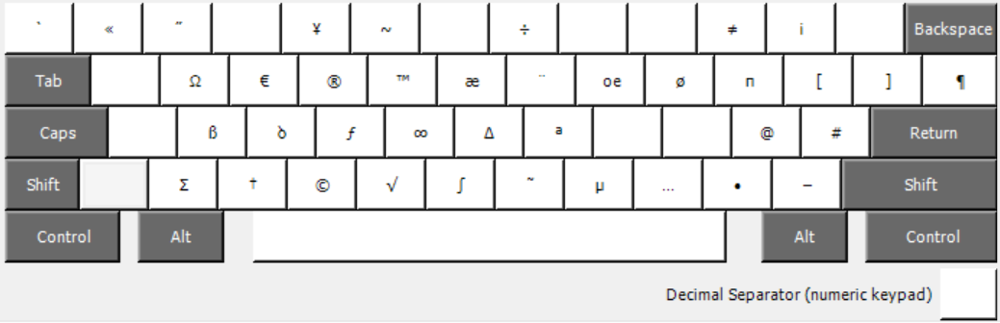

# Italian Mac like keyboard layout for Windows (alpha) 🇮🇹🍎💻

> If you're used to italian Mac keyboard input source but you're forced to work on a Windows machine, this might save you some frustration.

## Mapping

*Alt Gr (or Alt + Ctrl)*

## Installation

1. Run `installer/setup.exe`

## Build

1. Download [Microsoft Keyboard Layout Creator 1.4](https://www.microsoft.com/en-us/download/details.aspx?id=22339)
2. Open `italian-mac-keyboard-layout-for-windows.klc`
3. Click `Project > Build DLL and setup package`

